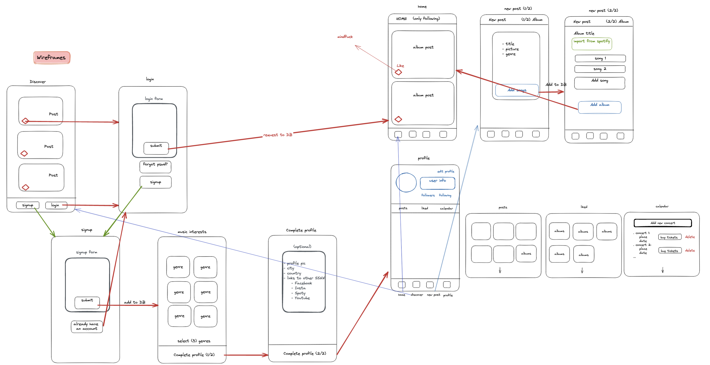

# SoundTribe

[]()

## Description

This is a project developed by Marc Bertran Suárez and Gerard Solanes Hernández as the project for the second module at Ironhack. The purpose of the application is to connect music bands with new fans and adventurous listeners. 

Get in the deep jungle of SoundTribe. If you are a music band, form a tribe. If you are an explorer, discover new sounds from the tribes.

---

## Instructions

When cloning the project, change the <code>sample.env</code> for an <code>.env</code> with the values you consider:
```js
PORT=3000
MONGO_URL='mongodb://localhost:27017/app-name'
SESSION_SECRET='SecretOfYourOwnChoosing'
NODE_ENV='development'
```
Then, run:
```bash
npm install
```
To start the project run:
```bash
npm run start
```

To work on the project and have it listen for changes:
```bash
npm run dev
```

---

## Wireframes
Substitute this image with an image of your own app wireframes or designs



---

## User stories (MVP)
There are 2 types of user:
- Tribe
- (Fans)
Tribe stories
- Tribe can sign up and create and account
- Tribe can login
- Tribe can log out
- Tribe can post a new album
- Tribe can edit (title, image and description) of posted album
- Tribe can delete album
- Tribe can see random posts according their interests of genre in discover page

Fan stories
- Fan can sign up and create and account
- Fan can login
- Fan can log out
- Fan can see random posts according their interests of genre in discover page

## User stories (Backlog)

- Tribe can add tracks to posted album
- Tribe & Fan can like/dislike posts
- Tribe & Fan can follow/unfollow other Tribes
- Tribe can post concerts in calendar
- Add home page with posts from other Tribes you follow

---

## Models

User:

```js
const userSchema = new Schema(
  {
    username: {
      type: String,
      trim: true,
      required: [true, 'Username is required.'],
      unique: true
    },
    email: {
      type: String,
      required: [true, 'Email is required.'],
      unique: true,
      lowercase: true,
      trim: true
    },
    hashedPassword: {
      type: String,
      required: [true, 'Password is required.']
    },
    type: {
      type: String,
      enum: ['tribe', 'fan'],
      required: [true, 'You must choose between Band or Fan.']
    },
    interests: {
      type: [String],
      required: [true, 'Interests are required.']
    },
    picture: {
      type: String,
      default: 'https://external-content.duckduckgo.com/iu/?u=https%3A%2F%2Fdiscoverafricanart.com%2Fwp-content%2Fuploads%2F2017%2F07%2FDAA-Houzz-profile.jpg&f=1&nofb=1&ipt=219a451070beec9677f6682221d5f467ed36dd8c119b74e1a27cd945347e6999&ipo=images'
    },
    city: String,
    country: String,
    spotifyLink: String,
    instagramLink: String
  },
  {
    timestamps: true
  }
);

const albumSchema = new Schema ({
    title: {
        type: String,
        required: [true, 'An album needs to have a title']
    },
    image: {
        type: String,
    },
    description: {
        type: String,
        default: 'No description provided'
    },
    genres: {
        type: [String],
        required: [true, 'An album needs to have one genre at least']
    },
    tribe: {
        type: Schema.Types.ObjectId,
        ref: 'User'
    },
    tracks: {
        type: [{
            trackUrl: {
                type: String
            },
            trackName : {
                type: String,
                default: 'No name'
            },
            trackNumber: {
                type: Number,
                min: 1
            }
        }]
    }
}, {
    timestamps: true
});

const likeSchema = new Schema({
    albumId: {
        type: Schema.Types.ObjectId,
        ref: 'Album'
    },
    likeUserId: {
        type: Schema.Types.ObjectId,
        ref: 'User'
    }
}, {
    timestamps: true
});

const followSchema = new Schema({
    followerId: {
        type: Schema.Types.ObjectId,
        ref: 'User'
    },
    followeeId: {
        type: Schema.Types.ObjectId,
        ref: 'User'
    }
}, {
    timestamps: true
});

const eventSchema = new Schema({
    tribeId:{
        type: Schema.Types.ObjectId,
        ref: 'User'
    },
    date: {
        type: Date,
        required: [true, 'A date is required']

    },
    location: {
        type: String,
        required: [true, 'A location is required']
    },
    ticketsLink : {
        type: String
    }
});

const attendSchema = new Schema({
    eventId : {
        type: Schema.Types.ObjectId,
        ref: 'Event'
    },
    userId: {
        type: Schema.Types.ObjectId,
        ref: 'User'
    }
});
```

---

## Routes

| Name  | Method | Endpoint    | Protected | Req.body            | Redirects |
|-------|--------|-------------|------|---------------------|-----------|
| Landing  | GET   | /           | No   |                     |           |
| Login | GET    | /auth/login | No |                      |           |
| Login | POST | /auth/login   | No | { usernameOrEmail, password }  | /home         |
| Signup | GET    | /auth/signup | No |                      |           |
| Signup | POST | /auth/signup   | No | { username, email, password, type }  | /auth/interests  |
| Interests  | GET    | /profile/interests | Yes |                      |           |
| Interests | POST | /profile/interets   | Yes | { genres }  | /auth/complete-profile   |
| Complete Profile | GET | /profile/complete-profile   | Yes |   |    |
| Complete Profile | POST | /profile/complete-profile   | Yes | { picture, country, city, spotifyLink, instagramLink }  | /profile/posts   |
| Logout | GET | /profile/logout   | Yes |  | /auth/login   |
| Home  | GET   | /home           | Yes   |                     |           |
| Discover  | GET   | /discover           | Yes   |                     |           |
| Discover Search  | POST   | /discover/search | Yes   |  {userQuery} |           |
| Profile Posts  | GET   | /profile/posts  | Yes   |                 |           |
| Profile Liked  | GET   | /profile/liked     | Yes   |       |           |
| Profile Calendar  | GET   | /profile/calendar    | Yes   |            |           |
| Edit Profile  | GET   | /profile/edit      | Yes   |                     |           |
| Edit Profile  | POST   | /profile/edit           | Yes   | { picture, country, city, spotifyLink, instagramLink } | /profile/edit/interests |
| Edit Interests  | GET   | /profile/interests      | Yes   |                     |           |
| Edit Interests  | POST   | /profile/edit      | Yes   |   { genres }  | /profile/posts |
| View Other User Posts  | GET   | /profile/view/:userId/posts  | Yes   |         |           |
| View Other User Calendar  | GET   | /profile/view/:userId/calendar | Yes   |       |         |
| View followers of a profile  | GET   | /profile/:userId/followers     | Yes   |         |           |
| View following of a profile  | GET   | /profile/:userId/following | Yes   |          |           |
| Delete Profile  | GET   | /profile/delete-profile      | Yes   |               | /     |
| Detail Album  | GET   | /posts/detail/:albumId      | Yes   |                     |           |
| New Album  | GET   | /posts/new      | Yes   |                     |           |
| New Album  | POST   | /posts/new  | Yes   | { title, description, genres } | /posts/new/:albumId/add-tracks|
| Add Tracks Local  | GET   | /posts/new/:albumId/add-tracks | Yes   |                     |           |
| Add Tracks Local | POST   | /posts/new/:albumId/add-tracks | Yes   | {tracksForm, tracksNamesForm }| /profile/posts|
| Add Tracks Spotify  | GET   | /posts/new/:albumId/add-tracks/spotify | Yes   |            |           |
| Add Tracks Spotify  | POST   | /posts/new/:albumId/add-tracks/spotify | Yes   |          | /profile/posts|
| Edit Album  | GET   | /posts/edit/:albumId     | Yes   |                     |           |
| Edit Album  | POST   | /posts/edit/:albumId | Yes  | { title, description, genres }| /profile/posts|
| Delete Album  | GET   | /posts/delete/:albumId | Yes   |                     | /profile/posts |
| New Follow  | POST   | /follow/:followeeId      | Yes   |                     | 'back' |
| Delete Follow  | POST   | /follow/delete/:followeeId     | Yes   |        | /profile/view/:followeeId/posts|
| Like & Dislike Album  | POST   | /like/edit/:albumId     | Yes   |              |${previousUrl}?scroll=${scrollPosition || 0}|
| New event  | GET   | /events/new     | Yes   |                     |           |
| New event  | POST   | /events/new     | Yes   | { location, date, ticketsLink }  | /profile/calendar |
| Edit event  | GET   | /events/edit/:eventId     | Yes   |                     |           |
| Edit event  | POST   | /events/edit/:eventId | Yes   | { location, date, ticketsLink } | /profile/calendar|
| Delete event  | GET   | /events/delete/:eventId     | Yes   |                     | /profile/calendar |
| Attend event  | GET   | /attend/:eventId    | Yes   |                     |  'back'  |

---

## Useful links

- [Github Repo](https://github.com/Sound-Tribe/sound-tribe)
- [Trello kanban](https://trello.com/b/ZQtJWWhq/soundtribe)
- [Deployed version](https://soundtribe.fly.dev/)
- [Presentation slides](https://my.visme.co/view/w433ngy6-soundtribe-slides#s1)


